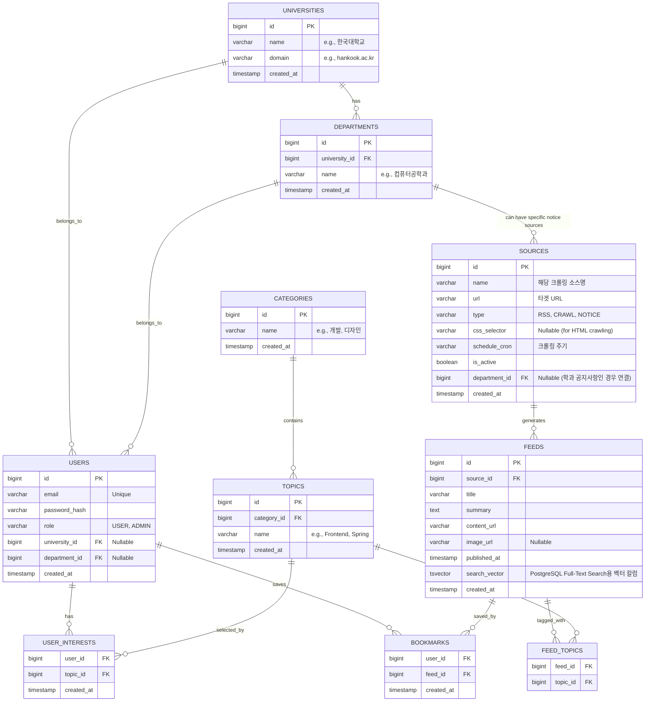

# CampusTab Database Schema (ERD)

The database is designed for PostgreSQL. It handles user management, university/department metadata, flexible content curation via Categories/Topics, and source management for crawlers.

## PostgreSQL ERD (Mermaid)

## Table Details & PostgreSQL Search Optimization
- **Full-Text Search (FTS)**: `FEEDS` 테이블에 `tsvector` 타입의 `search_vector` 컬럼을 둡니다. 이는 트리거를 통해 `title`, `summary`, 연관 `TOPICS.name` 등이 병합되어 자동 업데이트됩니다.
- **Indexes**: 
  - `FEEDS.search_vector`에 **GIN (Generalized Inverted Index)**를 생성하여 텍스트 검색 성능을 극대화합니다.
  - `FEEDS.published_at` 컬럼에 B-Tree 인덱스를 생성하여 최신 순 정렬 조회를 가속합니다.
  - `USER_INTERESTS`, `BOOKMARKS`, `FEED_TOPICS` 복합키(PK)에 대한 기본 인덱싱.
